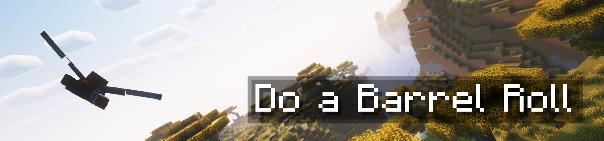
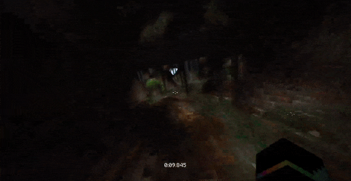

# 
 Do Another Barrel Roll 

## Description

**Do Another Barrel Roll is a native NeoForge port of [enjarai's Do a Barrel Roll](https://github.com/enjarai/do-a-barrel-roll).** Same mod, different name because CurseForge does not allow a loader in a project title. It shares the mod id `do_a_barrel_roll` with the original, so the two cannot be installed together.

Do a Barrel Roll is a lightweight, mostly clientside mod that changes elytra flight to be more fun and semi-realistic. It redesigns movement around a completely unlocked camera, giving you full pitch, yaw and roll control in flight, plus a set of subtle and less subtle camera modifiers including smoothing and banking.

Upstream ships a NeoForge build, but it is the Fabric jar running through Sinytra Connector and it requires both Connector and the Forgified Fabric API to work. This port is written against NeoForge directly:

* No Sinytra Connector, no Fabric API, no Forgified Fabric API.
* No CICADA, no Mod Menu, no Fabric permissions API.
* Mojang mappings throughout, with the camera, HUD, damage, keybinding and networking hooks moved onto NeoForge's own events where NeoForge has one.

Behaviour is otherwise the same as upstream. Configs, keybinds, permission nodes and the server handshake all keep their original names, so an existing `do_a_barrel_roll-client.json` or `do_a_barrel_roll-server.json` carries over untouched.

## Controls

The default controls are as follows, but can be modified:

- Mouse x axis to roll
- Mouse y axis to pitch
- strafe keys (normally A and D) to yaw

The flight bindings sit in their own key conflict context, so binding yaw to A and D does not conflict with vanilla strafing: they are only live while you are flying.

## Configuration

Install [YACL](https://modrinth.com/mod/yacl) and the config screen is reachable from the Config button next to the mod in NeoForge's mod list, or from a keybind you can set yourself. Without YACL the mod still runs; the button just offers to install it.

A wide range of options are available, including custom mouse behavior, elytra activation restrictions and changing values of modifiers like banking, sensitivity and more.

## Server-side features

Visual aspects of the mod (playermodel roll in particular) can be synced between clients by installing it on the server-side as well. Everything is still fully compatible with both vanilla clients and servers. All the following configurations are valid:

- Server with mod, client with mod: visuals are synced
- Server with mod, client without mod: client can join and play without issues, but can't see visuals
- Server without mod, client with mod: client can join and play without issues, but can only see their own visuals
- Server with mod, client 1 with mod, client 2 with mod, client 3 without mod: client 1 and 2 can see each other's visuals, client 3 cannot
- Server without mod, client 1 with mod, client 2 with mod, client 3 without mod: client 1 and 2 can only see their own visuals

## Installation

* Minecraft 1.21.1
* NeoForge 21.1.249 or newer
* [YACL](https://modrinth.com/mod/yacl) 3.6.0 or newer, optional, for the config screen

Drop the JAR in your `mods` folder. Nothing else is required.

## Disclaimers

This mod does not actually modify the flight physics themselves, so in most cases it shouldn't trigger anticheat. However, doing things like loop de loops looks to the server like rapid camera movement and may get you flagged. **Use at your own risk.**

## For server admins

### Thrusting

The mod includes a "thrusting" feature that is probably considered cheating by most servers, as it lets users accelerate without using fireworks. **It is disabled by default on servers.**

To allow it, install the mod on your server and, while in the world, use the "Server" tab on the config screen. That tab is only available to level 3 operators and players holding the `do_a_barrel_roll.configure` permission. You can also edit `config/do_a_barrel_roll-server.json` directly to configure the mod without a client.

On platforms that have no official support, send a packet to the client at login on the `do_a_barrel_roll:config_sync` channel and it will reply on `do_a_barrel_roll:config_response`. The payload layout matches upstream's protocol version 4.

### Other features

The server config includes a few other options:

- `allowThrusting`: Lets players accelerate with the thrust keys.
- `forceEnabled`: Forces the mod to be enabled for all players, regardless of their client configuration.
- `forceInstalled`: Rejects any player trying to join without having the mod installed on their client.
- `installedTimeout`: The amount of time (in ticks) to wait for a client to respond to the config sync packet. Increase this if players with bad connections are getting kicked despite having the mod installed.
- `kineticDamage`: How elytra wall impacts hurt, from vanilla through to disabled or instantly lethal.

Specific players can bypass configured restrictions with level 2 operator status or the `do_a_barrel_roll.ignore_config` permission. Both nodes are registered with NeoForge's permission API, so any permission handler mod can grant them.

## Differences from upstream

Everything a player interacts with is the same. What changed underneath:

- Controller support is gone. Upstream's Controlify integration is a Fabric entrypoint and was already absent from the NeoForge build. The controller sensitivity settings are still in the config for anything else that drives the roll API.
- The Mod Menu search easter egg is gone with Mod Menu, which is Fabric-only. It was already absent from the NeoForge build.
- CICADA's update notices are gone. That is enjarai's Fabric-only library, and it was already absent from the NeoForge build.
- The clientbound roll packet keeps its original channel name; the serverbound one is renamed to `do_a_barrel_roll:roll_sync_c2s`, because NeoForge allows one payload per channel id rather than one per direction.
- Kinetic damage is applied through NeoForge's incoming damage event rather than by rewriting a local variable inside `LivingEntity.travel`.
- Camera roll, the crosshair widgets, the Peppy overlay and the F3 roll readout all go through NeoForge events instead of mixins.
- Lang files are JSON rather than the YAML upstream compiles with yamlang.

## Credits

Do a Barrel Roll is by [enjarai](https://github.com/enjarai), based on the [Cool Elytra Roll](https://github.com/Jorbon/cool_elytra) mod by [Jorbon](https://github.com/Jorbon), specifically its "realistic mode". Originally ported to Forge by [MehVahdJukaar](https://github.com/MehVahdJukaar).

Mod icon by Mizeno.

Native NeoForge port by aspctt.

## Licensing

GPL-3.0-only, the same licence as upstream. The full terms are in [LICENSE](./LICENSE).
